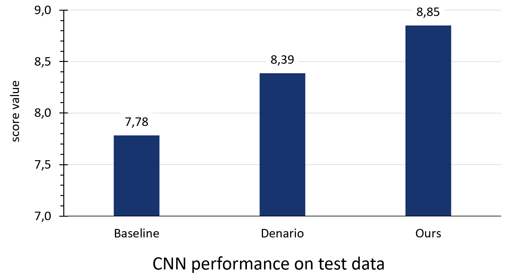

# NeurIPS-2025-Weak-Lensing-Uncertainty-Challenge

In this project we aimed to address a problem from the Weak Lensing Uncertainty Challenge organized by the FAIR Universe. The challenge under consideration is to predict cosmological parameters from weak lensing maps. In this project, we not only proposed an improved baseline, but also tried compare our solution with those provided by a state-of-the-art multi-agent AI system designed as a scientific research assistant.  

Final score comparison:  

   

 
